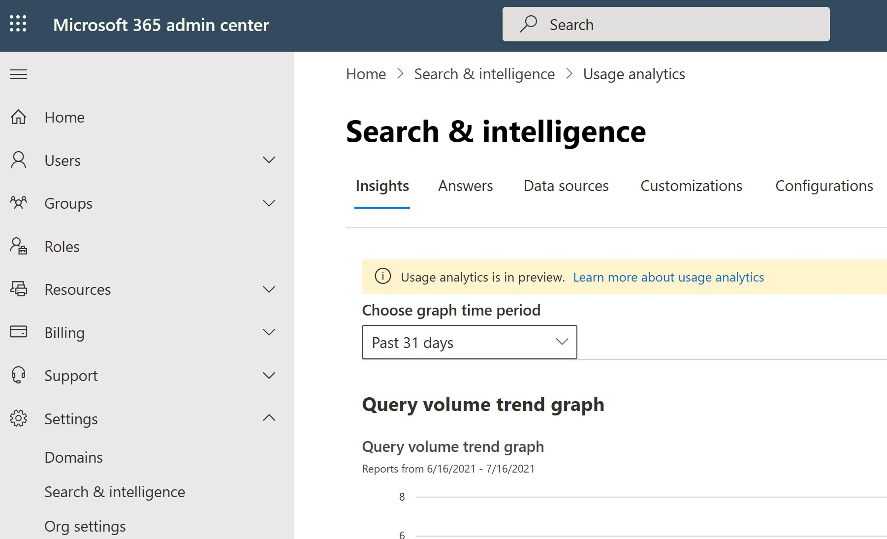
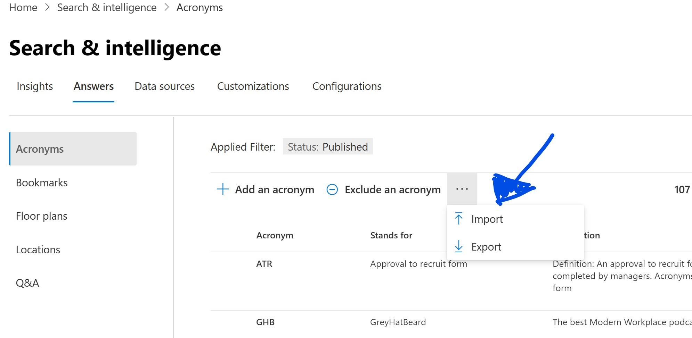
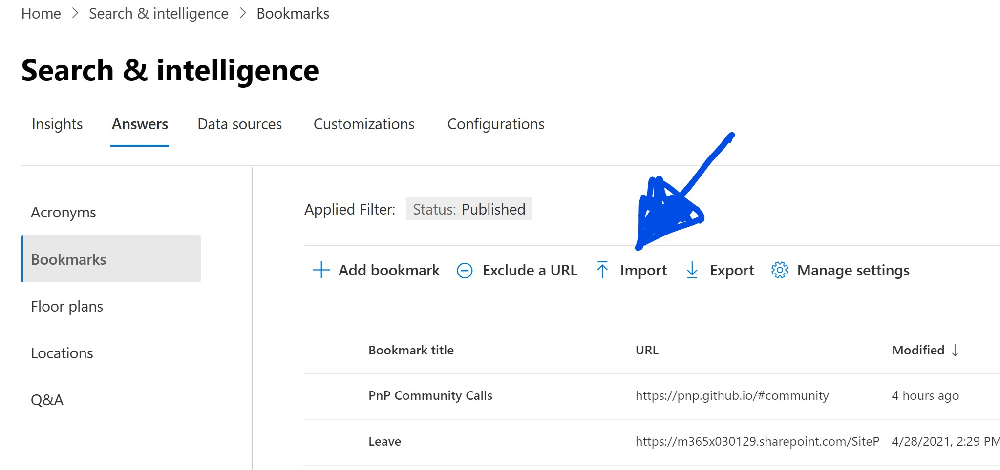
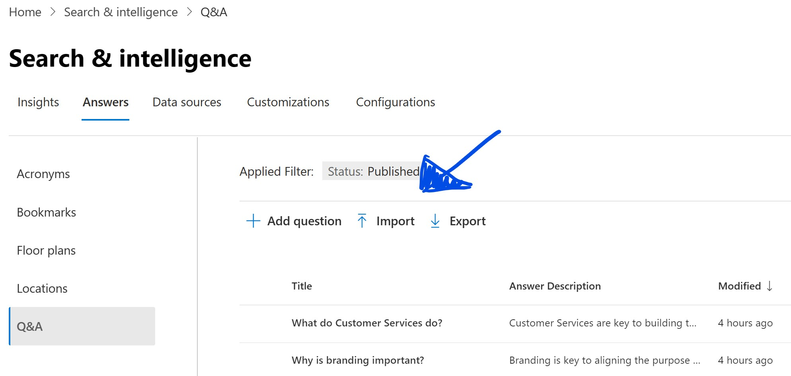
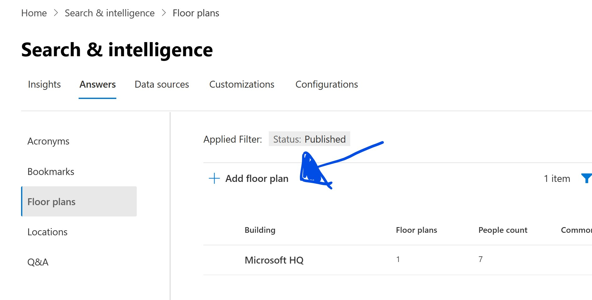
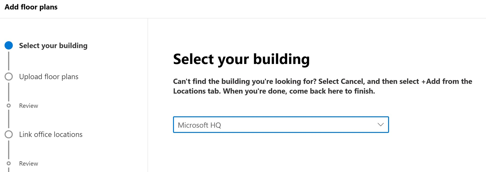
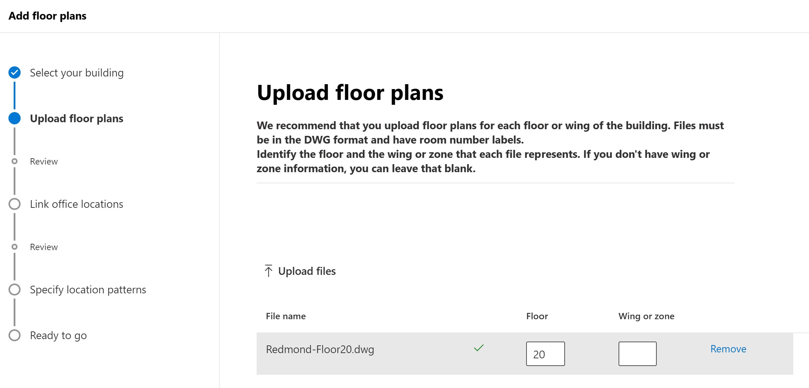
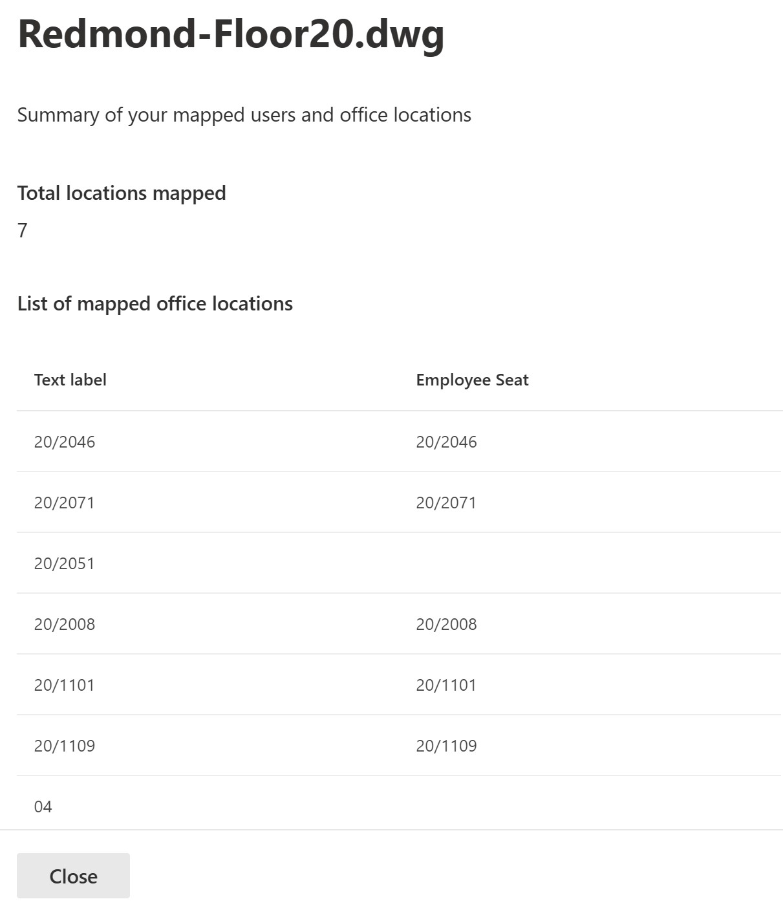

# MSSearch-Samples

These files are designed to make it easy to demonstrate Microsoft Search functionality. They are intended to be used with the Partner sample tenants but can be used anywhere. Below are instructions for each file but generally, they will need the {your-tenant-name} replaced with your own tenant name. All processes start from the Search Admin page.

## Acronyms

Select Answers and then Acronyms from Search Admin. Select Import and upload the [CSV](MSSearchSample-Acronyms.csv).

See further details in [Microsoft Docs](https://docs.microsoft.com/en-us/microsoftsearch/manage-acronyms).

## Bookmarks

Select Answers and then Bookmarks from Search Admin. Select Import and upload the [CSV](MSSearchSample-Bookmarks.csv).

See further details in [Microsoft Docs](https://docs.microsoft.com/en-us/microsoftsearch/manage-bookmarks).

## Q&As

Select Answers and then Q&A from Search Admin. Select Import and upload the [CSV](MSSearchSample-QandAs.csv).

See further details in [Microsoft Docs](https://docs.microsoft.com/en-us/microsoftsearch/manage-qas).

## Locations

Select Answers and then Locations from Search Admin. Select Import and upload the [CSV](MSSearchSample-Locations.csv).

See further details in [Microsoft Docs](https://docs.microsoft.com/en-us/microsoftsearch/manage-locations).

## Floor Plans

OK, this one is a little different. Select Answers and then Floor Plans from Search Admin (you will have needed to have added the locations already). Click on Add Floor Plan.

Select Microsoft HQ as the building.

Upload the [DWG file](RedmondFloor20.dwg) as the floor plan, set 20 as the floor and click Next.

The next screen should show 7 locations mapped. Clicking on details should show the locations that have been mapped to an employee.

Cick Continue Mapping and then Skip and Publish and you are done. It will take up to 48 hours for the Floor Plans to appear for a user. To test, search for Isaiah and click on the Office Location.

## Search queries

There are a set of [sample queries](Sample queries.csv) based on this data that will return data when searched from Office.com. Other entries will return data but these are known based on the Answers in this sample.
